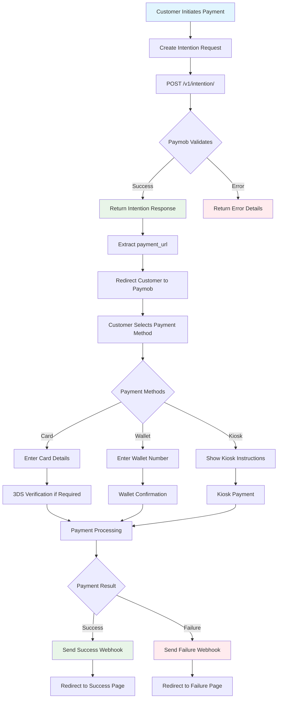
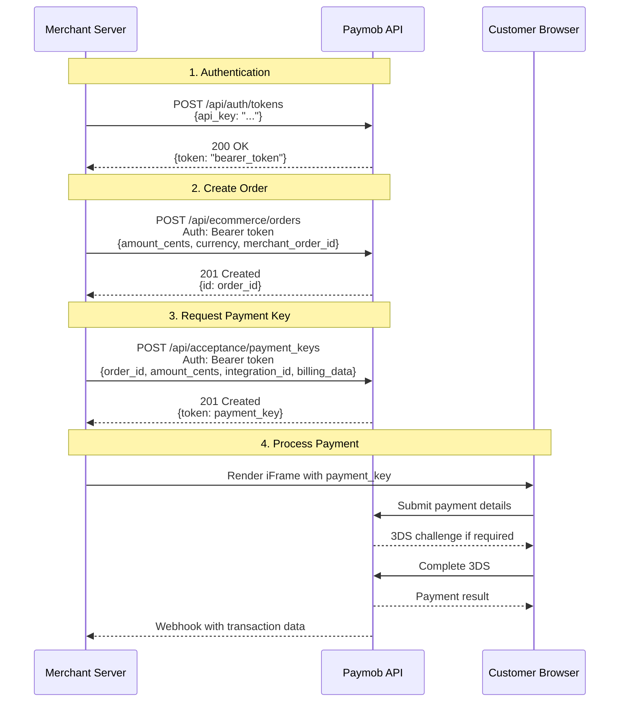
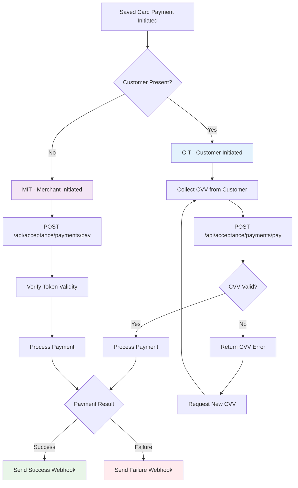
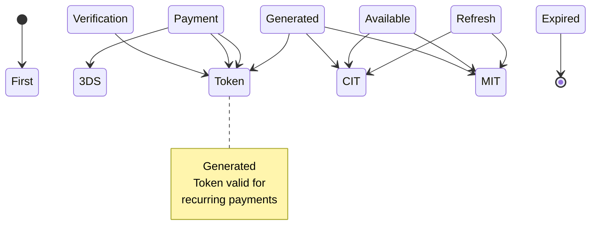
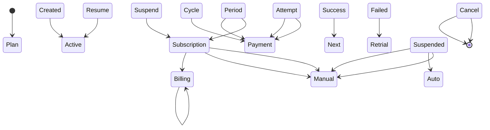
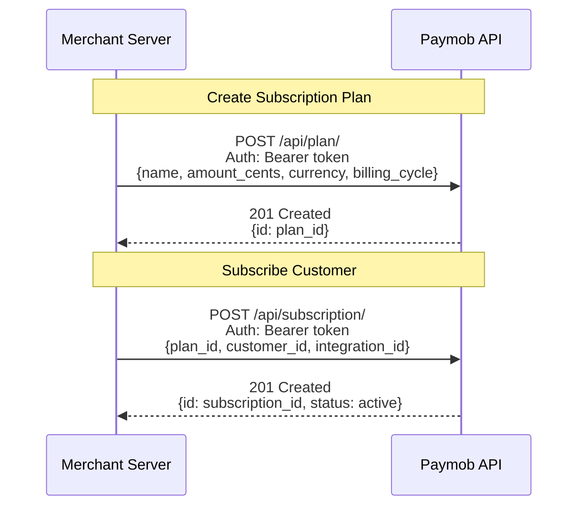
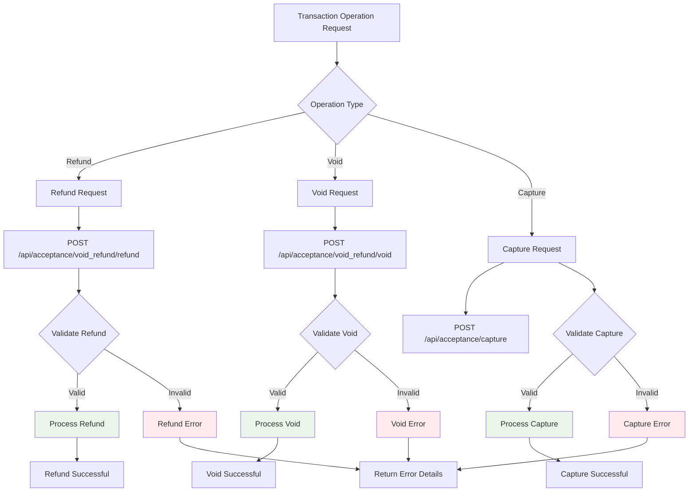
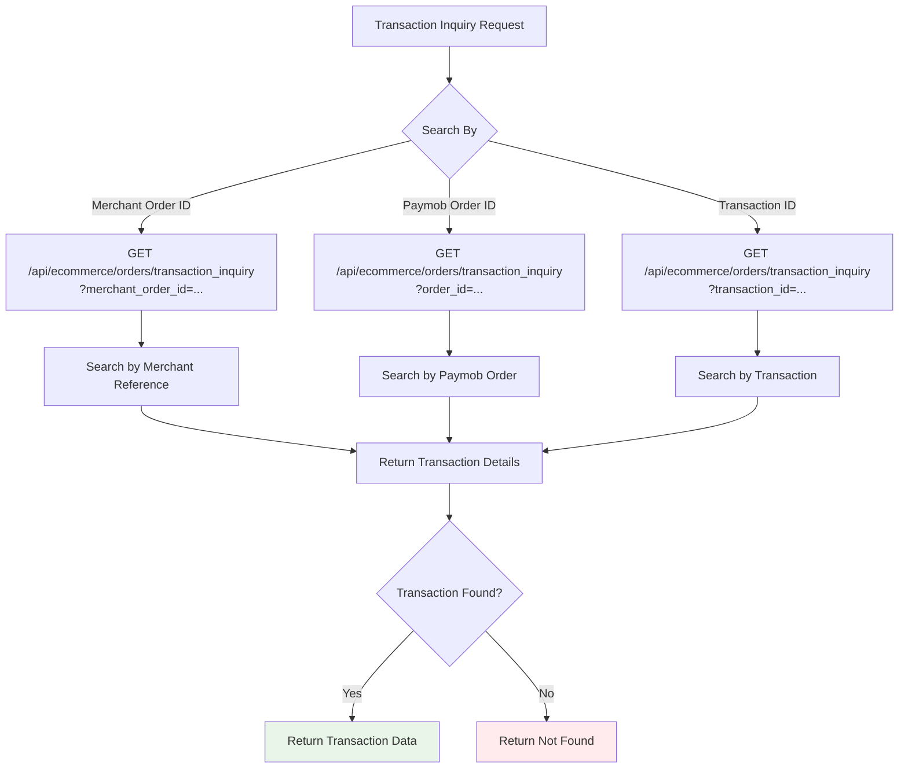
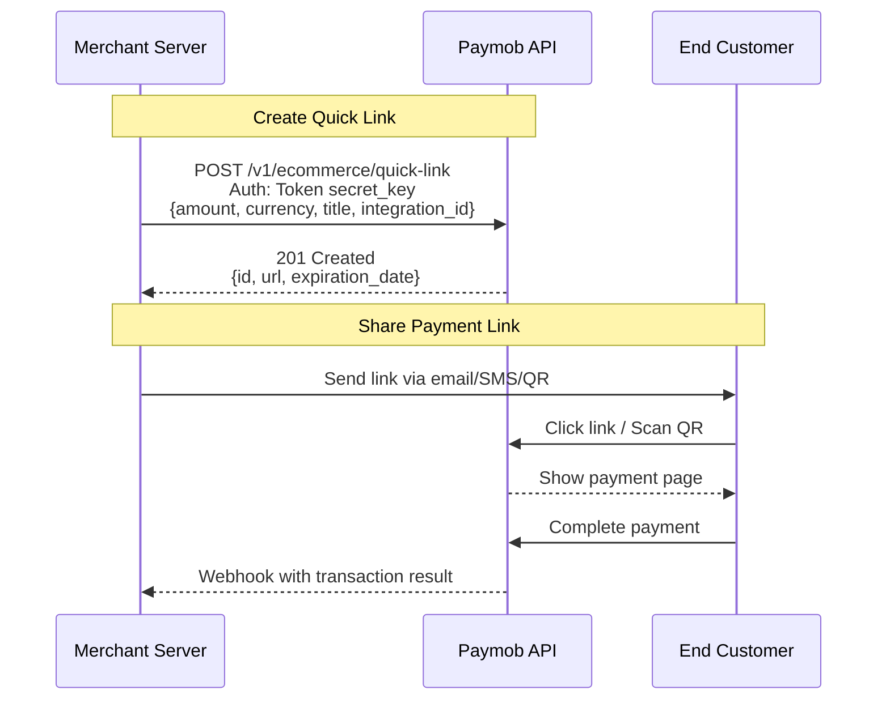
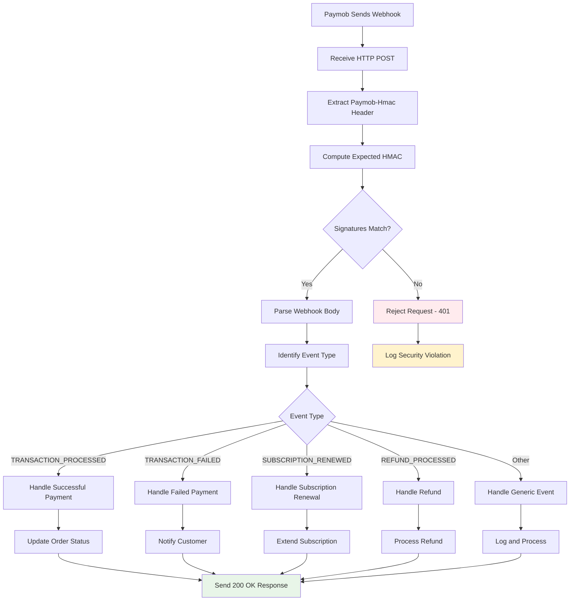

# Paymob Integration Flows

This document provides comprehensive visualizations of all Paymob API flows implemented in the Java SDK.

## 📋 Table of Contents

- [Payment Intention Flow](#payment-intention-flow-recommended)
- [Legacy Standard Flow](#legacy-standard-flow-auth--order--key)
- [Saved Card Flows](#saved-card-flows-cit--mit)
- [Subscription Lifecycle](#subscription-lifecycle)
- [Transaction Management](#transaction-management)
- [Transaction Inquiry](#transaction-inquiry)
- [Quick Link Generation](#quick-link-generation)
- [Webhook Processing](#webhook-processing)

## 💳 Payment Intention Flow (Recommended)

The modern unified checkout that supports all payment methods through a single API call.



### Key Components

**Request Parameters:**
- `amount`: Payment amount in cents
- `currency`: 3-letter currency code (EGP, SAR, AED, OMR)
- `integration_ids`: List of payment method IDs
- `billing_data`: Customer information (name, email, phone)
- `items`: Optional line items for detailed invoices
- `expiration`: Optional payment link expiration

**Response Fields:**
- `id`: Unique intention identifier
- `client_secret`: Secret for hosted checkout
- `payment_url`: Hosted payment page URL

### Error Handling

| HTTP Code | Cause | Resolution |
|-----------|-------|------------|
| 401 | Invalid secret key | Verify credentials and region |
| 406 | Invalid request data | Check amount, currency, billing data |
| 404 | Integration ID not found | Verify integration exists in region |
| 500 | Paymob server error | Implement retry logic |

## 🔧 Legacy Standard Flow (Auth → Order → Key)

> **Note:** This flow is maintained for backward compatibility. New integrations should use the Payment Intention flow.



### When to Use Legacy Flow

- **Existing integrations** using the classic iFrame approach
- **Custom payment UI** requiring direct iframe embedding
- **Specific compliance requirements** needing the 3-step process

### Migration Path

To migrate from Legacy to Intention flow:

1. Replace 3-step process with single `IntentionService.create()` call
2. Update webhook handler to use new event structure
3. Remove iframe embedding code - use hosted checkout URL
4. Update error handling for new response format

## 💳 Saved Card Flows (CIT vs MIT)

Two distinct flows for tokenized payments based on customer presence.



### CIT (Customer Initiated Transaction)

**Use Cases:**
- Customer saves card during checkout
- Customer manually selects saved card
- Subscription payments with customer interaction

**Required Fields:**
- `token`: Saved card token
- `cvv`: 3-4 digit CVV (collected from customer)
- `order_id`: Paymob order ID
- `amount_cents`: Payment amount
- `currency`: Currency code

**Security Note:** CVV is never stored - only used for the current transaction.

### MIT (Merchant Initiated Transaction)

**Use Cases:**
- Recurring subscription charges
- Automatic top-ups
- Late payment processing
- Installment payments

**Required Fields:**
- `token`: Saved card token
- `order_id`: Paymob order ID
- `amount_cents`: Payment amount
- `currency`: Currency code

**Security Note:** No CVV required - relies on previously authenticated token.

### Token Lifecycle



## 🔄 Subscription Lifecycle

Complete subscription management from plan creation to cancellation.



### Plan Creation Flow



### Billing Cycle Management

| Billing Cycle | Frequency | Common Use Cases |
|---------------|-----------|------------------|
| WEEKLY | Every 7 days | Digital content, services |
| BIWEEKLY | Every 14 days | Payroll, mid-tier services |
| MONTHLY | Every 30 days | SaaS, subscriptions |
| QUARTERLY | Every 90 days | Premium services |
| ANNUAL | Every 365 days | Enterprise licenses |

### Retrial Logic Configuration

- **Retrial Days**: Number of days to retry failed payments
- **Reminder Days**: Days before billing to send reminders
- **Max Retries**: Maximum retry attempts before suspension

### Webhook Events for Subscriptions

- `SUBSCRIPTION_CREATED`: New subscription activated
- `SUBSCRIPTION_RENEWED`: Successful recurring payment
- `SUBSCRIPTION_FAILED`: Payment retry attempt failed
- `SUBSCRIPTION_SUSPENDED**: Subscription suspended due to failures
- `SUBSCRIPTION_RESUMED`: Subscription reactivated
- `SUBSCRIPTION_CANCELLED`: Subscription terminated

## 🔀 Transaction Management

Post-payment operations for refunds, voids, and captures.



### Operation Details

#### Refund
- **Purpose**: Reverse a completed transaction (full or partial)
- **Timing**: Any time after settlement
- **Required**: `transaction_id`, optional `amount_cents`
- **Note**: If no amount specified, full refund is processed

#### Void
- **Purpose**: Cancel a same-day transaction before settlement
- **Timing**: Same day only (before batch processing)
- **Required**: `transaction_id`
- **Benefit**: No processing fees compared to refund

#### Capture
- **Purpose**: Finalize an authorized-only transaction
- **Timing**: Within 14 days of authorization
- **Required**: `transaction_id`, `amount_cents`, `authorisation_date`
- **Validation**: Authorization date must be within 14-day window

## 🔍 Transaction Inquiry

Flexible transaction lookup by multiple identifiers.



### Query Parameters

| Parameter | Type | Description | Example |
|-----------|------|-------------|---------|
| `merchant_order_id` | String | Your internal order reference | `ORDER-12345` |
| `order_id` | Integer | Paymob's internal order ID | `123456789` |
| `transaction_id` | Integer | Specific transaction ID | `987654321` |

### Response Data

```json
{
  "id": 987654321,
  "order_id": 123456789,
  "merchant_order_id": "ORDER-12345",
  "amount_cents": 10000,
  "currency": "EGP",
  "status": "SUCCESS",
  "gateway_response_code": "APPROVED",
  "gateway_response_message": "Transaction successful",
  "created_at": "2025-01-15T10:30:00Z"
}
```

## 🔗 Quick Link Generation

Create shareable payment links without full checkout sessions.



### Use Cases

- **Invoice Payments**: Send payment links with invoices
- **Pay-by-Link**: Social media and messaging apps
- **QR Codes**: Physical locations and print materials
- **Email Collections**: Customer service and billing

### Quick Link Features

| Feature | Description |
|---------|-------------|
| **Custom Title** | Descriptive payment description |
| **Expiration** | Optional link expiry date |
| **Multi-Payment** | Link can be used multiple times |
| **Tracking** | Monitor link usage and conversions |
| **Branding** | Custom merchant branding on payment page |

## 🛡️ Webhook Processing

Secure webhook handling with HMAC signature verification.



### HMAC Verification Process

```java
// 1. Extract received HMAC
String receivedHmac = request.getHeader("Paymob-Hmac");

// 2. Concatenate request body values in Paymob order
StringBuilder data = new StringBuilder();
data.append(params.get("amount_cents"));
data.append(params.get("created_at"));
data.append(params.get("currency"));
data.append(params.get("error_occured"));
data.append(params.get("has_parent_transaction"));
data.append(params.get("id"));
data.append(params.get("integration_id"));
data.append(params.get("is_3d_secure"));
data.append(params.get("is_auth"));
data.append(params.get("is_capture"));
data.append(params.get("is_refunded"));
data.append(params.get("is_standalone_payment"));
data.append(params.get("is_voided"));
data.append(params.get("order_id"));
data.append(params.get("owner"));
data.append(params.get("pending"));
data.append(params.get("source_data_pan"));
data.append(params.get("source_data_sub_type"));
data.append(params.get("source_data_type"));
data.append(params.get("success"));

// 3. Compute HMAC-SHA512
String expectedHmac = HmacUtil.computeHmacSha512(data.toString(), hmacSecret);

// 4. Constant-time comparison
boolean isValid = MessageDigest.isEqual(
    expectedHmac.getBytes(StandardCharsets.UTF_8),
    receivedHmac.getBytes(StandardCharsets.UTF_8)
);
```

### Security Best Practices

- **Always verify HMAC** before processing any webhook
- **Use constant-time comparison** to prevent timing attacks
- **Log verification failures** for security monitoring
- **Respond quickly** with 200 OK to prevent retries
- **Idempotency**: Handle duplicate webhook deliveries gracefully

---

## 📚 Additional Resources

- **[Java SDK Documentation](../README.md)**: Complete API reference
- **[Paymob API Docs](https://docs.paymob.com)**: Official API documentation
- **[Production Guide](../Paymob-Java-SDK-Production-Guide.md)**: Deployment best practices
- **[Examples](../examples/)**: Ready-to-use code samples

For technical support or questions about these flows, please refer to the [Paymob Support Portal](https://support.paymob.com).
