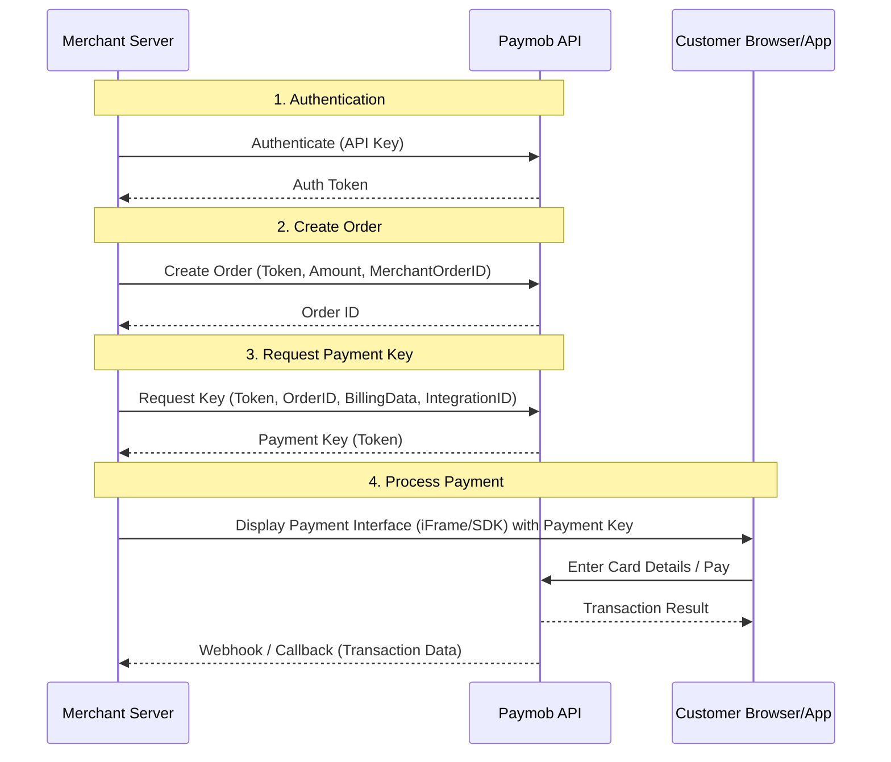
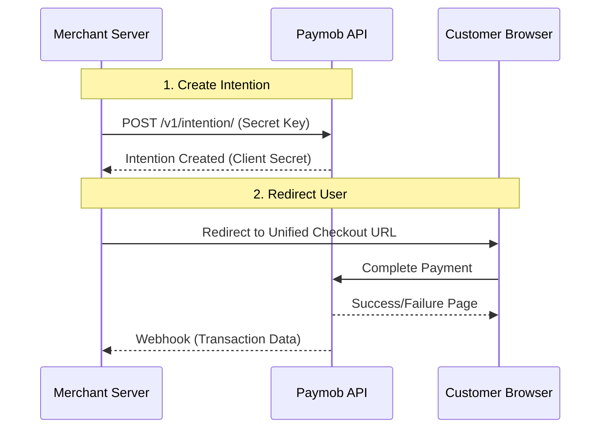
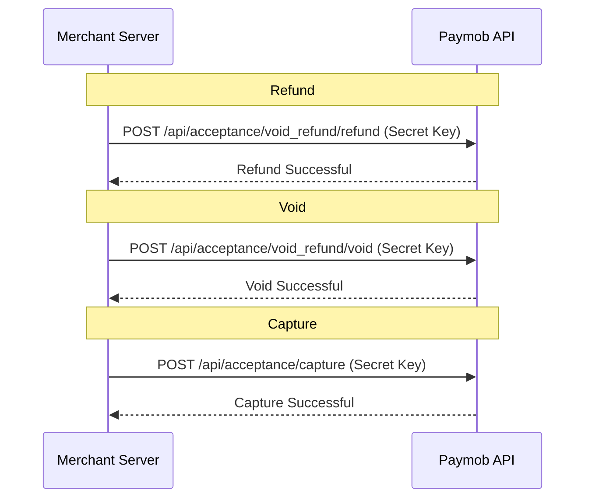

# Paymob Integration Flow

This document visualizes the standard Paymob API flow implemented in this SDK.

## High Level Overview

## Detailed Steps

### 1. Authentication
Obtain an authentication token using your API key. This token is required for all subsequent requests.
*   **SDK Method**: `AuthService.authenticate()`
*   **Input**: API Key (configured in `Paymob.init()`)
*   **Output**: `token` (String)

### 2. Order Registration
Register an order on Paymob system.
*   **SDK Method**: `OrderService.createOrder()`
*   **Input**: Auth Token, Amount (in cents), Currency, Merchant Order ID
*   **Output**: `id` (Order ID)

### 3. Payment Key Request
Generate a payment key for a specific order. This key encapsulates the amount and order details.
*   **SDK Method**: `PaymentService.requestPaymentKey()`
*   **Input**: Auth Token, Order ID, Amount, Billing Data, Integration ID
*   **Output**: `token` (Payment Key)

### 4. Transaction Handling
Use the Payment Key to render the payment interface (iFrame or Mobile SDK) on the client side.
*   After payment, Paymob redirects the user and sends a callback (webhook) to the merchant server.
*   **SDK Method**: `TransactionService.getTransaction()` can be used to query transaction status using the Transaction ID received in the callback.

---

## Unified Checkout Flow (Intention API)

This flow simplifies the process into a single step: Creating an Intention.

### Steps
1.  **Create Intention**: Call `IntentionService.createIntention()` with amount, currency, and billing data.
2.  **Redirect**: Generate the redirect URL using `IntentionService.getUnifiedCheckoutUrl(clientSecret)`.

---

## Transaction Control Flow

Manage your transactions after they are created.

