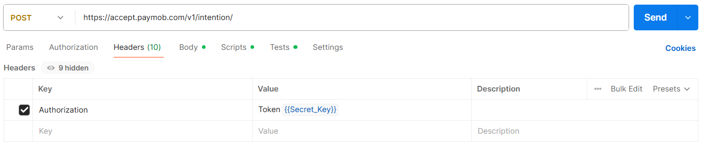
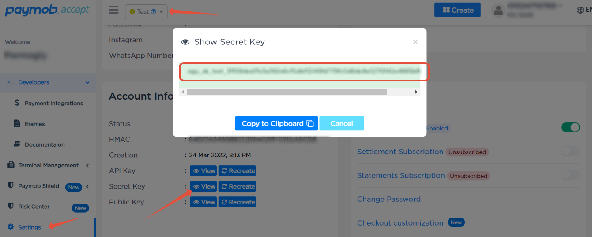
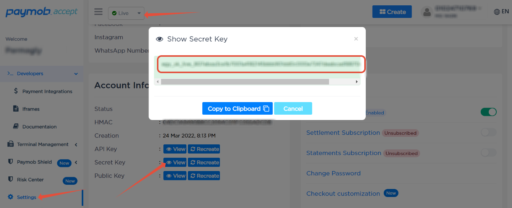
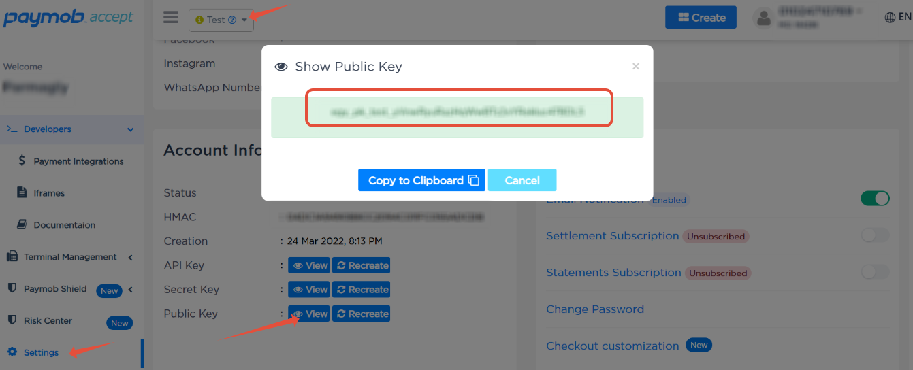
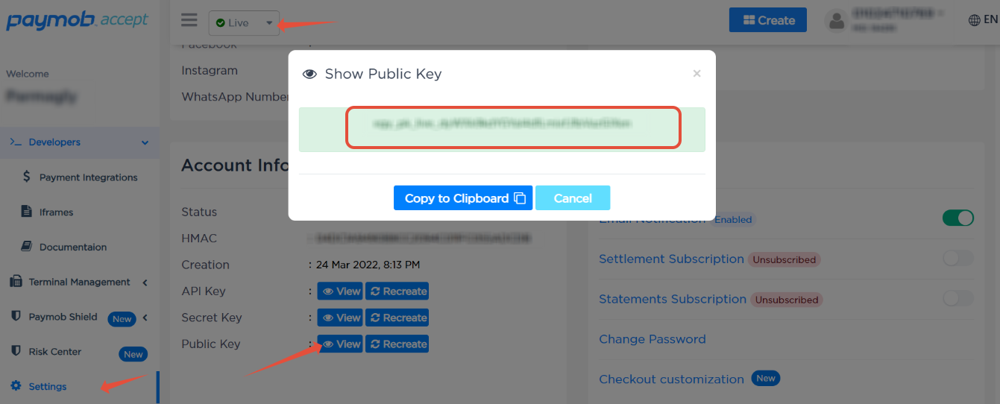
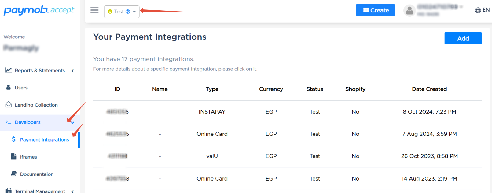
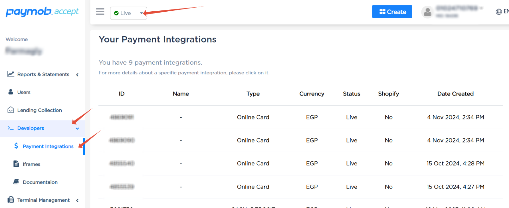

# Getting Paymob Credentials

Use this guide to collect everything you need before integrating the SDK.

## Required Credentials

| Credential | Required For | Where Used in SDK |
|------------|--------------|-------------------|
| `secretKey` | Authenticated API calls (intention create/update, refund/void/capture, saved cards) | `PaymobConfig.secretKey(...)` |
| `publicKey` | Unified checkout URL generation and intention retrieval endpoint | `PaymobConfig.publicKey(...)` |
| `hmacSecret` | Webhook and redirect callback signature validation | `PaymobConfig.hmacSecret(...)` |
| `apiKey` | Bearer-token based endpoints (subscriptions, quick links, inquiry) | `PaymobConfig.apiKey(...)` |
| `integrationId` (or multiple IDs) | Payment method selection in checkout/intention requests | `IntentionRequest.paymentMethods(...)` |

## How to Obtain Credentials from Paymob Dashboard

### 1. Sign In and Pick Environment

1. Sign in to your Paymob dashboard at `https://accept.paymob.com`.
2. Choose `Test Mode` for sandbox values or `Live Mode` for production values.
3. Keep environment consistent: test keys with test integrations, live keys with live integrations.

### 2. Get Secret Key

1. Go to `Settings -> Account Info`.
2. Click `View` next to `Secret Key`.
3. Copy the key and store it securely.





### 3. Get Public Key

1. Stay in `Settings -> Account Info`.
2. Click `View` next to `Public Key`.
3. Copy the key for your selected mode.




### 4. Get Integration ID

1. Go to `Developers -> Payment Integrations`.
2. Copy the integration IDs for the payment methods you plan to support.
3. If you use multiple payment methods, collect all needed IDs.




### 5. Get HMAC Secret and API Key

1. Go to `Settings -> Account Info`.
2. Copy `HMAC Secret` for webhook/callback signature validation.
3. Copy `API Key` for Bearer-token services (`subscriptions`, `quick links`, `inquiry`).

## Environment Checklist

Use test/sandbox values in development and live values in production.

- Keep each environment isolated: test keys with test integrations, live keys with live integrations.
- Never mix keys across environments or regions.
- Rotate credentials if they are exposed in logs, commits, or support tickets.

## Region Mapping

Pick the region that matches your merchant account and issued keys.

| Region Enum | Base URL |
|-------------|----------|
| `PaymobRegion.EGYPT` | `https://accept.paymob.com` |
| `PaymobRegion.KSA` | `https://ksa.paymob.com` |
| `PaymobRegion.UAE` | `https://uae.paymob.com` |
| `PaymobRegion.OMAN` | `https://oman.paymob.com` |

## SDK Initialization Example

```java
import com.paymob.sdk.core.PaymobClient;
import com.paymob.sdk.core.PaymobConfig;
import com.paymob.sdk.core.PaymobRegion;

PaymobConfig config = PaymobConfig.builder()
    .secretKey("sk_test_...")
    .publicKey("pk_test_...")
    .hmacSecret("hmac_test_...")
    .apiKey("api_test_...")
    .region(PaymobRegion.EGYPT)
    .build();

PaymobClient client = new PaymobClient(config);
```

## Validation Tips Before First API Call

- Create a test intention with a known valid `integrationId`.
- Confirm you can generate a checkout URL.
- Send a test webhook and verify HMAC validation.
- Call one API-key service (for example, quick links) to verify `apiKey` setup.

If any step fails with auth errors, re-check region and credential source first.
