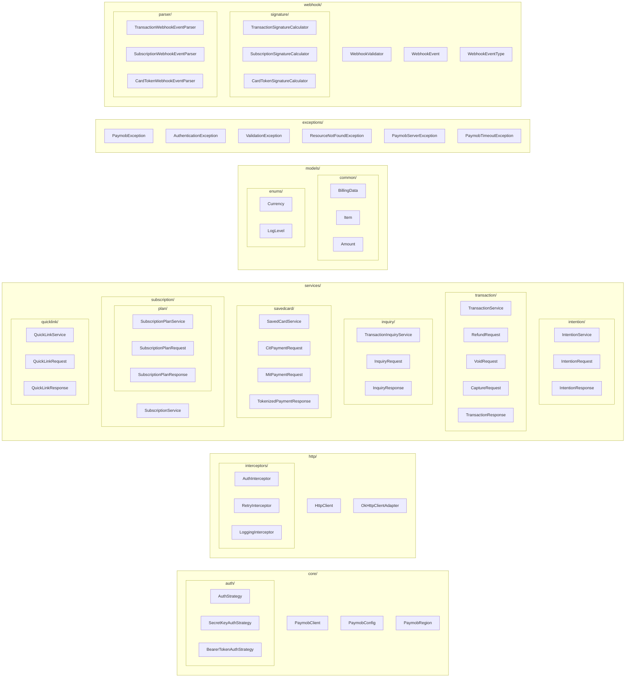
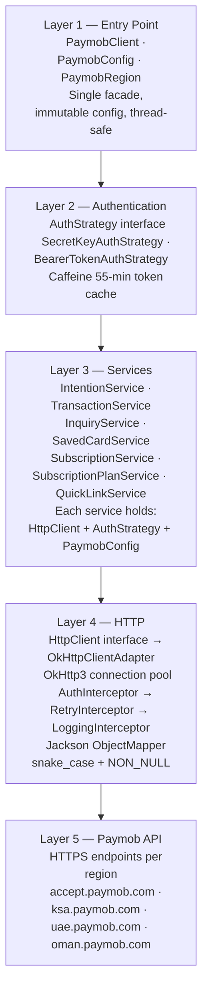
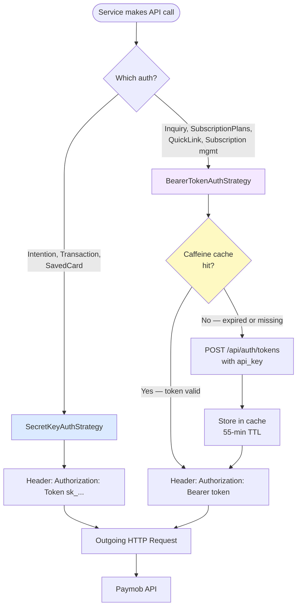
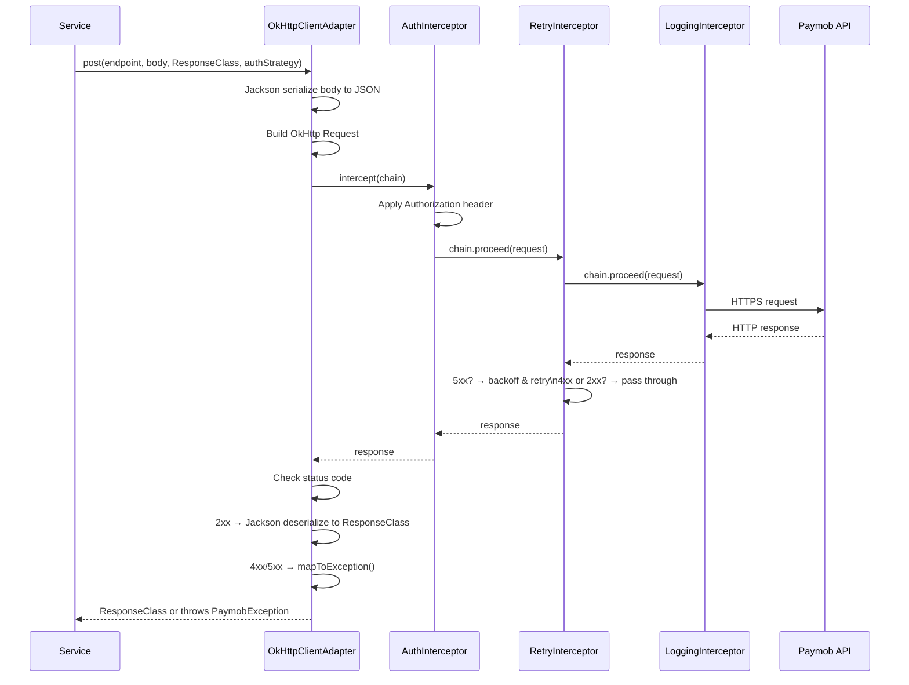
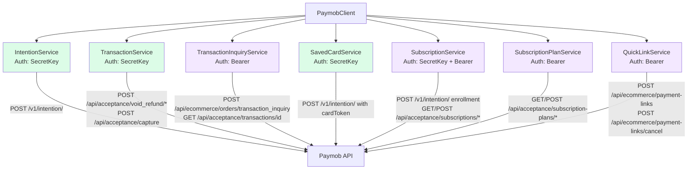
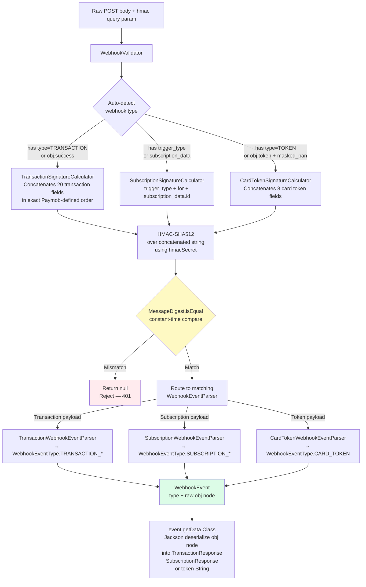
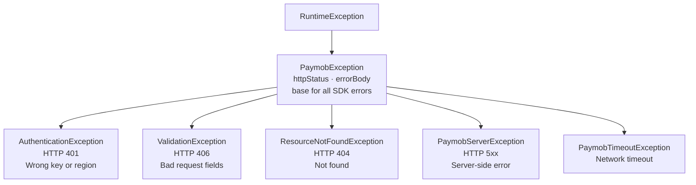
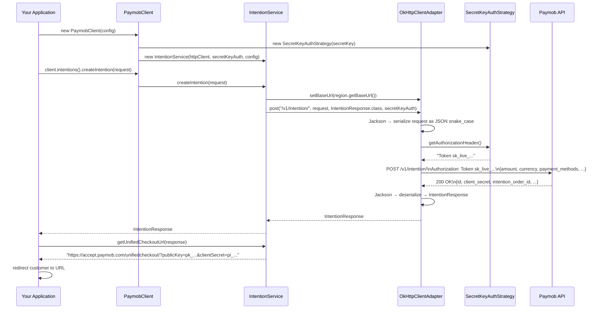
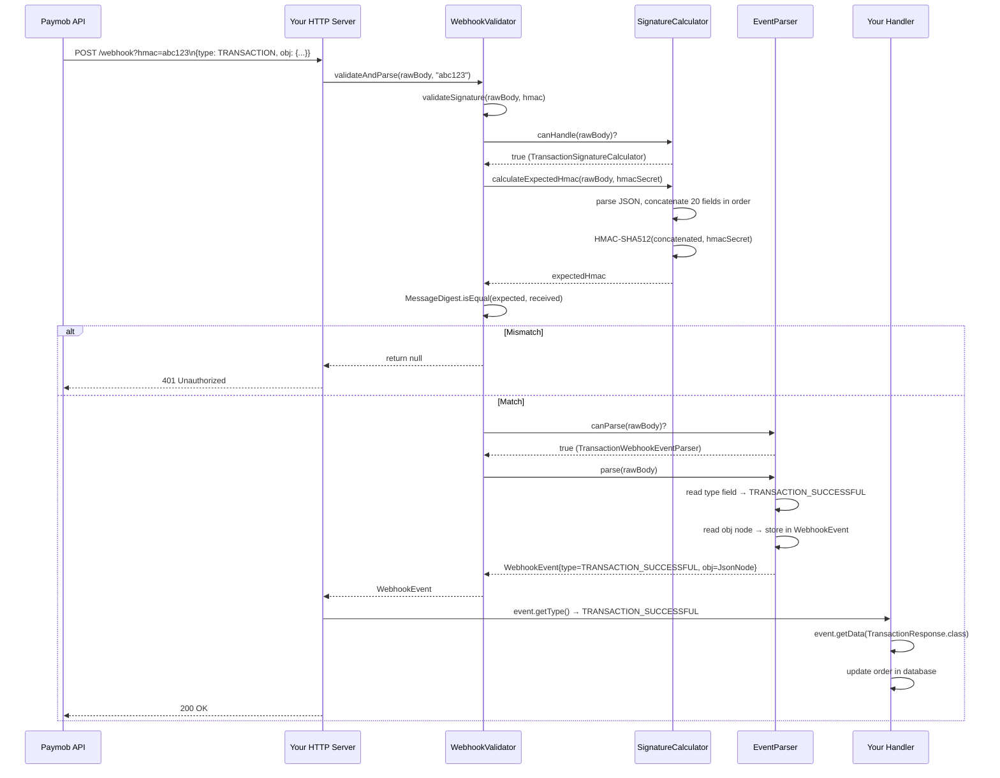

# System Design & Architecture

This document describes the complete system design of the Paymob Java SDK — its layers, components, data flow, design decisions, and how everything connects.

## Table of Contents

- [High-Level Architecture](#high-level-architecture)
- [Component Map](#component-map)
- [Layer Breakdown](#layer-breakdown)
- [Authentication System](#authentication-system)
- [HTTP Pipeline](#http-pipeline)
- [Service Layer](#service-layer)
- [Webhook System](#webhook-system)
- [Exception Hierarchy](#exception-hierarchy)
- [Data Flow — Payment Intention](#data-flow--payment-intention)
- [Data Flow — Webhook Processing](#data-flow--webhook-processing)
- [Design Decisions](#design-decisions)

---

## High-Level Architecture

```mermaid
graph TB
    subgraph Application["Client Application"]
        APP[Your Java App]
    end

    subgraph SDK["Paymob Java SDK"]
        direction TB

        subgraph Entry["Entry Point"]
            PC[PaymobClient]
            CFG[PaymobConfig]
            RGN[PaymobRegion]
        end

        subgraph Auth["Authentication Layer"]
            AS[AuthStrategy interface]
            SK[SecretKeyAuthStrategy]
            BT[BearerTokenAuthStrategy]
            CC[Caffeine Token Cache]
        end

        subgraph Services["Service Layer"]
            IS[IntentionService]
            TS[TransactionService]
            IQS[TransactionInquiryService]
            SCS[SavedCardService]
            SS[SubscriptionService]
            SPS[SubscriptionPlanService]
            QLS[QuickLinkService]
        end

        subgraph HTTP["HTTP Layer"]
            HC[HttpClient interface]
            OKH[OkHttpClientAdapter]
            subgraph Interceptors["Interceptor Chain"]
                AI[AuthInterceptor]
                RI[RetryInterceptor]
                LI[LoggingInterceptor]
            end
            JM[Jackson ObjectMapper]
        end

        subgraph Webhook["Webhook System"]
            WV[WebhookValidator]
            subgraph Calculators["Signature Calculators"]
                TSC[TransactionSignatureCalculator]
                SSC[SubscriptionSignatureCalculator]
                CSC[CardTokenSignatureCalculator]
            end
            subgraph Parsers["Event Parsers"]
                TEP[TransactionWebhookEventParser]
                SEP[SubscriptionWebhookEventParser]
                CEP[CardTokenWebhookEventParser]
            end
            WE[WebhookEvent]
            WET[WebhookEventType enum]
        end

        subgraph Exceptions["Exception Layer"]
            PE[PaymobException]
            AE[AuthenticationException]
            VE[ValidationException]
            NF[ResourceNotFoundException]
            SE[PaymobServerException]
            TE[PaymobTimeoutException]
        end
    end

    subgraph Paymob["Paymob API"]
        direction LR
        AUTH_EP[POST /api/auth/tokens]
        INT_EP[POST /v1/intention/]
        TXN_EP[POST /api/acceptance/void_refund]
        INQ_EP[POST /api/ecommerce/orders/transaction_inquiry]
        SUB_EP[POST/GET /api/acceptance/subscriptions]
        PLAN_EP[POST/GET /api/acceptance/subscription-plans]
        QL_EP[POST /api/ecommerce/payment-links]
        SC_EP[POST /v1/intention/ with token]
    end

    APP --> PC
    PC --> CFG
    PC --> Auth
    PC --> Services

    SK --> AS
    BT --> AS
    BT --> CC

    Services --> HC
    HC --> OKH
    OKH --> Interceptors
    OKH --> JM
    AI --> AS

    OKH -->|HTTPS| Paymob
    BT -->|Token fetch| AUTH_EP
    IS --> INT_EP
    TS --> TXN_EP
    IQS --> INQ_EP
    SS --> SUB_EP
    SPS --> PLAN_EP
    QLS --> QL_EP
    SCS --> SC_EP

    OKH -->|error| Exceptions

    APP --> WV
    WV --> Calculators
    WV --> Parsers
    Parsers --> WE
    WE --> WET
```

---

## Component Map

---

## Layer Breakdown

---

## Authentication System

**Why two strategies?**

Paymob exposes two auth schemes depending on the API group. Most modern endpoints accept a `Token <secret_key>` header directly. Older subscription and inquiry endpoints require a short-lived Bearer token obtained by exchanging the API key. The SDK handles both transparently — callers never deal with auth headers directly.

The Bearer token is cached in Caffeine with a 55-minute TTL (Paymob tokens expire after 60 minutes, leaving a 5-minute safety buffer). Token refresh is synchronized under a lock to prevent concurrent fetches when the cache expires.

---

## HTTP Pipeline

**Retry logic:** `RetryInterceptor` retries up to 3 times on 5xx responses with exponential backoff (1s → 2s → 4s, capped at 10s). 4xx responses are never retried — they represent a problem with the request itself, not a transient server issue.

**Serialization:** Jackson uses `SNAKE_CASE` naming and omits null fields. This means Java `billingData` serializes as `billing_data` matching the Paymob API contract, and optional fields left null are cleanly absent from the request body.

---

## Service Layer

**Green = SecretKey auth | Purple = Bearer auth**

`SubscriptionService` is unique: enrollment calls (`subscribe`, `addSecondaryCard`) use SecretKey auth because they go through the Intention API. Management calls (`suspend`, `resume`, `cancel`, `list`, etc.) use Bearer auth because they hit the older subscription endpoints.

---

## Webhook System

**Why separate Calculators and Parsers?**

Paymob uses different field concatenation rules for each webhook type when computing the HMAC. The `WebhookSignatureCalculator` hierarchy isolates this per-type concatenation logic. The `WebhookEventParser` hierarchy isolates the payload shape parsing. Keeping them separate means adding a new webhook type (a new calculator + a new parser) requires zero changes to the existing classes or to `WebhookValidator` beyond registering the new pair.

---

## Exception Hierarchy

All exceptions are unchecked (`RuntimeException`). `PaymobException` carries `httpStatus` and `errorBody` so callers can inspect the raw Paymob error response alongside the SDK message.

The `mapToException()` method in `OkHttpClientAdapter` is the single place where HTTP status codes are mapped to typed exceptions.

---

## Data Flow — Payment Intention

---

## Data Flow — Webhook Processing

---

## Design Decisions

### Why is `PaymobClient` a simple class and not a Builder-only construct?

`PaymobClient` supports both `new PaymobClient(config)` for simple cases and `PaymobClient.builder().config(...).httpClient(...).build()` for advanced use (e.g. injecting a custom `HttpClient` for testing). The simple constructor is the 95% case.

### Why are services eagerly initialized instead of lazy?

All services are created at `PaymobClient` construction time. This means startup is slightly heavier but there are no hidden costs or synchronization issues on first use. Services are stateless objects — creating them upfront is safe and predictable.

### Why does `SubscriptionService` receive both auth strategies?

Enrollment goes through the Intention API (SecretKey) while management operations (suspend, resume, list) go through older endpoints (Bearer). Rather than creating two separate service objects or switching auth inside the HTTP client, each call inside `SubscriptionService` explicitly passes the correct strategy. This makes the auth decision visible at the call site.

### Why is `HttpClient` an interface?

`HttpClient` is an interface so that tests can inject a `MockWebServer`-backed adapter or a pure mock without touching production code. The only production implementation is `OkHttpClientAdapter`.

### Why are all request/response objects mutable (have setters)?

Jackson requires either a no-arg constructor with setters, or `@JsonCreator` annotations. Setters were chosen for simplicity. Builders are provided for all request objects to give callers a clean construction API while keeping Jackson deserialization straightforward on responses.
